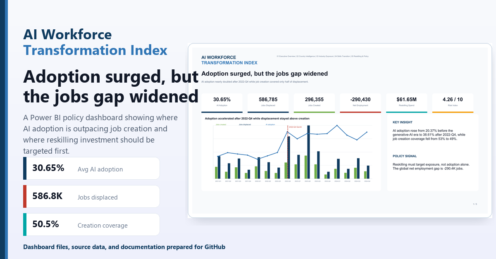

# AI Workforce Transformation Index - Power BI Dashboard

A professional Power BI policy briefing dashboard for the **DataDNA Dataset Challenge 2026-07: Global AI Adoption & Workforce Displacement Index**.

## Dashboard Message

AI adoption accelerated sharply after the generative-AI era began in 2022-Q4, but job creation is not keeping pace with displacement. The dashboard identifies where reskilling investment should be targeted by exposure, employment gap, and investment coverage.

## Key Findings

- Average AI adoption across the dataset is **30.65%**.
- AI-attributable displacement totals **586,785 jobs**, while creation totals **296,355 jobs**.
- Job creation offsets only **50.5%** of displacement, leaving a **-290,430 net employment gap**.
- Average adoption rose from **20.37% before the generative-AI era** to **38.61% after 2022-Q4**.
- Food & Beverage, Retail & E-commerce, Media & Entertainment, Automotive, and Manufacturing are priority watchlist industries.

## Repository Contents

```text
assets/
  aionyx_linkedin_showcase.png          # LinkedIn landscape showcase image
  aionyx_linkedin_square_showcase.png   # Square social version

data/
  dim_country.csv
  dim_date.csv
  dim_industry.csv
  dim_skill_category.csv
  fact_workforce_ai_index.csv

docs/
  CHALLENGE_BRIEF.md
  DATA_DICTIONARY.md

powerbi/
  aionyx_powerbi_redesign_pbip.zip      # Editable Power BI Project package
  aionyx_powerbi_dashboard_preview.pdf  # 5-page dashboard preview
```

## How To Open The Dashboard

1. Download or clone this repository.
2. Extract `powerbi/aionyx_powerbi_redesign_pbip.zip`.
3. Open `yusufjongo.pbip` in Power BI Desktop.
4. If Power BI asks for source paths, point the queries to the CSV files in this repository's `data/` folder.
5. Save as `.pbix` if you want a single Power BI Desktop file.

## Pages

1. **Executive Overview** - adoption acceleration, KPI story, and employment gap.
2. **Country Intelligence** - ranked country and regional comparisons without maps.
3. **Industry Exposure** - displacement and reskilling intensity by industry.
4. **Skills Transition** - skill categories ranked by employment gap and risk.
5. **Reskilling & Policy** - priority matrix and policy recommendations.

## Design Notes

The dashboard uses a clean policy-briefing style with dark blue, teal, green, and red accents. No maps, satellite visuals, globe visuals, or geography-shaped visuals are used.

## Data Source

Synthetic challenge dataset supplied for the DataDNA Dataset Challenge 2026-07.

## Preview



## Dashboard Preview

[📄 View Full PDF Report](aionyx_powerbi_dashboard_preview.pdf)
